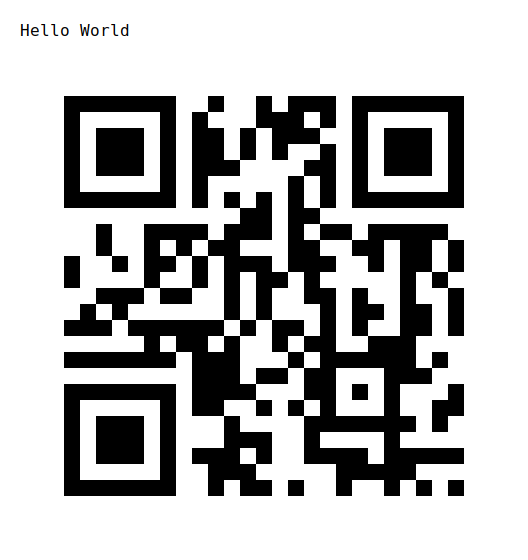
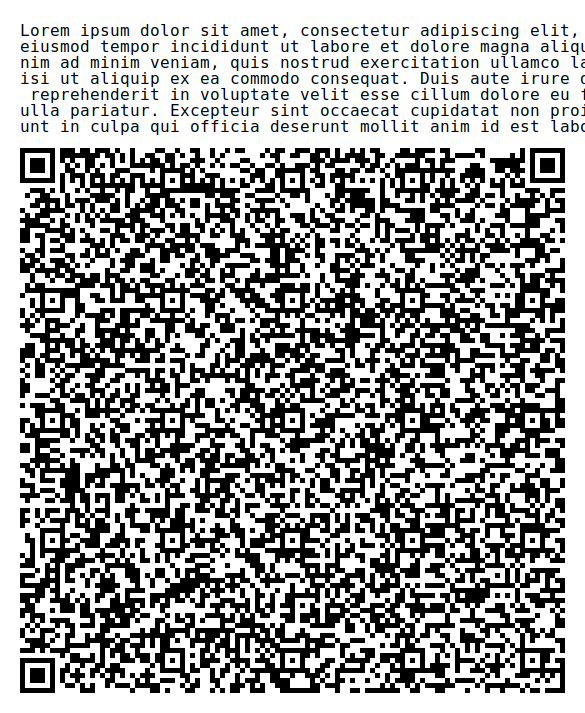

# qrcode-cli

[](https://travis-ci.org/lbeder/qrcode-cli)

QRCode Encoder CLI in Rust

## Usage

```bash
Usage: qrcode-cli DATA [options]
Version: 0.3.0

Options:
    -e, --eclevel EC_LEVEL
                        error correction level (L, M, Q, H) (default: M)
    -o, --output OUTPUT output path for the image QR code
    -t, --text          embed the original data on the image QR code
    -h, --help          print this help menu
    -v, --version       print version information
```

## Build

### Mac OS

```bash
git clone https://github.com/lbeder/qrcode-cli
cd qrcode-cli

cargo build --release
```

### Linux x86_x64

In order to get stuff working later, use the `nightly` branch of Rust:

```bash
rustup override set nightly
```

Install a standard Linux target on a Mac (note, that the opposite is currently impossible):

```bash
rustup target add x86_64-unknown-linux-musl
```

Use `homebrew` to download a community-provided binary for `musl` cross-compilation:

```bash
brew install FiloSottile/musl-cross/musl-cross
```

Now you can build it:

```bash
CROSS_COMPILE=x86_64-linux-musl- cargo build --target=x86_64-unknown-linux-musl
```

## Example

Let's see few QR code generation examples:

To encode `Hello World` using the `L` (up to ~7% damage):

> ./target/release/qrcode-cli --output images/example1.svg --eclevel L "Hello World"

Result:


To encode `Hello World` using the `H` (up to ~30% damage) with embedding of the original data:

> ./target/release/qrcode-cli --output images/example2.svg --eclevel H --text "Hello World"

Result:



To encode a long message `Hello World` using the `H` (up to ~30% damage) with embedding of the original data:

> ./target/release/qrcode-cli --output images/example3.svg --eclevel H --text "Lorem ipsum dolor sit amet, consectetur adipiscing elit, sed do eiusmod tempor incididunt ut labore et dolore magna aliqua. Ut enim ad minim veniam, quis nostrud exercitation ullamco laboris nisi ut aliquip ex ea commodo consequat. Duis aute irure dolor in reprehenderit in voluptate velit esse cillum dolore eu fugiat nulla pariatur. Excepteur sint occaecat cupidatat non proident, sunt in culpa qui officia deserunt mollit anim id est laborum."

Result:



## License

MIT License

Copyright (c) 2019 Leonid Beder

Permission is hereby granted, free of charge, to any person obtaining a copy
of this software and associated documentation files (the "Software"), to deal
in the Software without restriction, including without limitation the rights
to use, copy, modify, merge, publish, distribute, sublicense, and/or sell
copies of the Software, and to permit persons to whom the Software is
furnished to do so, subject to the following conditions:

The above copyright notice and this permission notice shall be included in all
copies or substantial portions of the Software.

THE SOFTWARE IS PROVIDED "AS IS", WITHOUT WARRANTY OF ANY KIND, EXPRESS OR
IMPLIED, INCLUDING BUT NOT LIMITED TO THE WARRANTIES OF MERCHANTABILITY,
FITNESS FOR A PARTICULAR PURPOSE AND NON-INFRINGEMENT. IN NO EVENT SHALL THE
AUTHORS OR COPYRIGHT HOLDERS BE LIABLE FOR ANY CLAIM, DAMAGES OR OTHER
LIABILITY, WHETHER IN AN ACTION OF CONTRACT, TORT OR OTHERWISE, ARISING FROM,
OUT OF OR IN CONNECTION WITH THE SOFTWARE OR THE USE OR OTHER DEALINGS IN THE
SOFTWARE.
